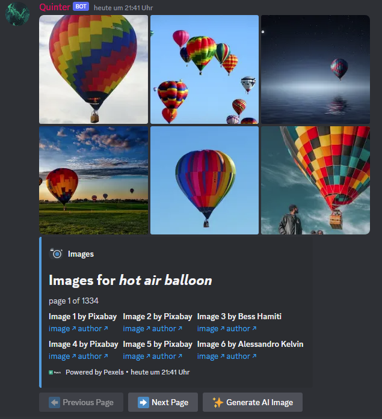
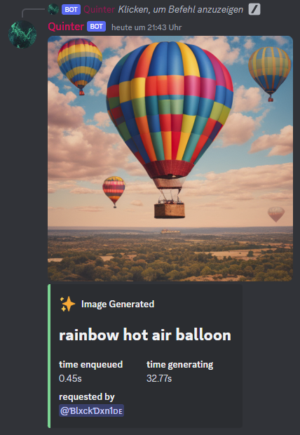
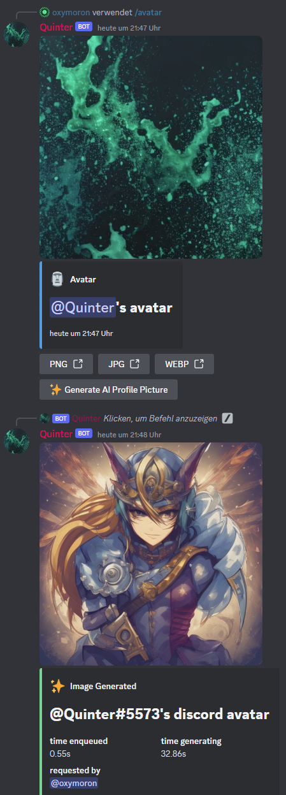
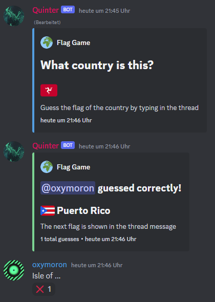
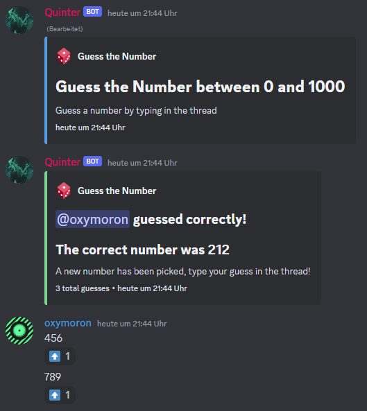
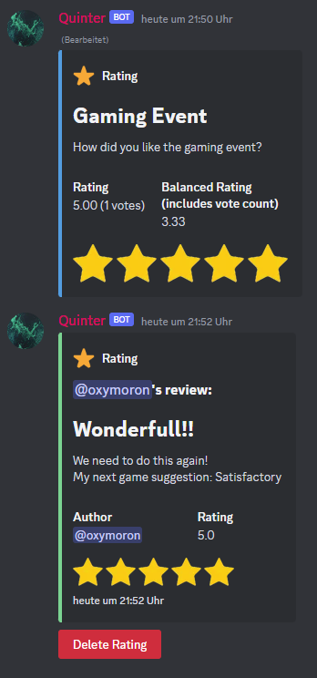

# Q U I N T E R

This discord bot was created during the bot competition hosted by the [Dev Sky Discord Server](https://discord.gg/devsky).
The contest ran for 2 weeks. We were given 3 possible features every 2 days and hat to implement one of the features within 48 hours.

You can add it using [this link](https://discord.com/api/oauth2/authorize?client_id=1177620658247716976&permissions=395137117248&scope=bot) but no promises about uptime and availability.
Make sure to set up proper permissions, eg. disabling the `/flaggame`, `/numbergame` and `/rating` commands for default users.

# Functions

## Images & AI Images

Use the `/images` command to view stock images
  

Use the `/imagine` to create an AI image (using stable diffusion turbo with [fastsdcpu](https://github.com/rupeshs/fastsdcpu))

`/avatar` shows information about a users profile picture and lets you generate a new profile picture with AI.

## Games

`/flaggame` creates a game where a flag emoji is shown and you have to type the correct name in the thread
  

`/numbergame` creates a game of guessing the number 

## Other

`/rating` creates an item to which users can add ratings with text and a star rating.

- `/meme` shows memes from reddit
- `/reminder` sets up an reminder with a note and a duration
